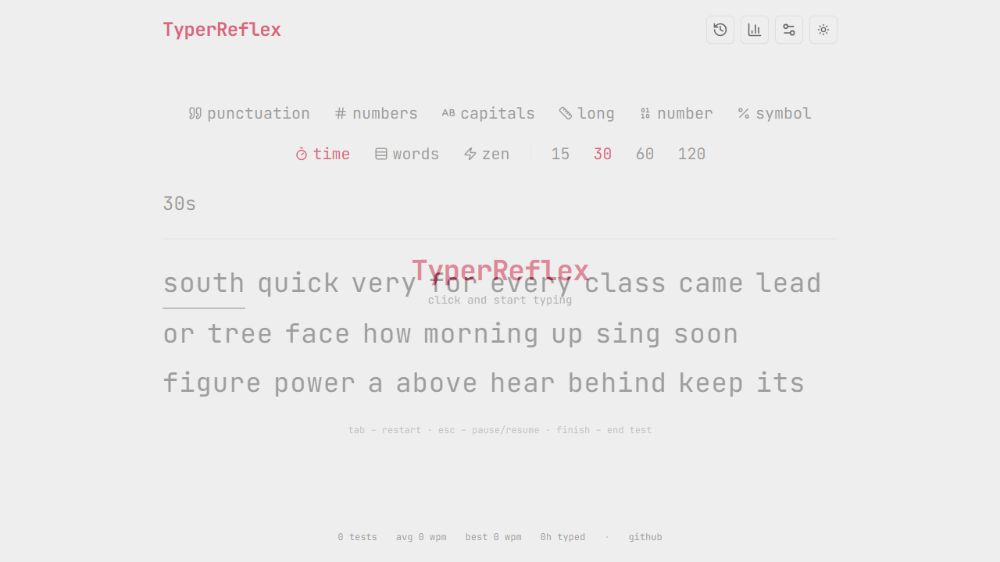
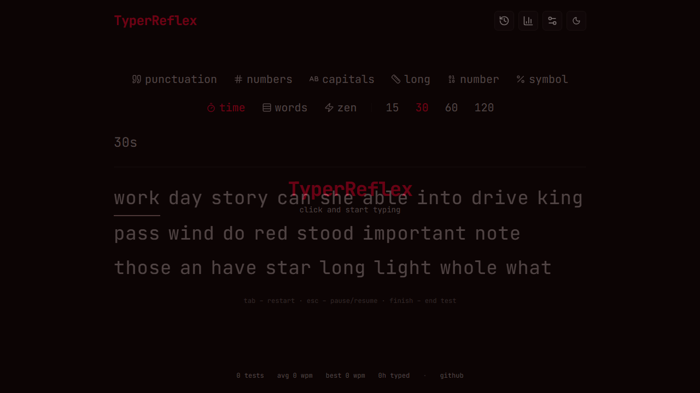
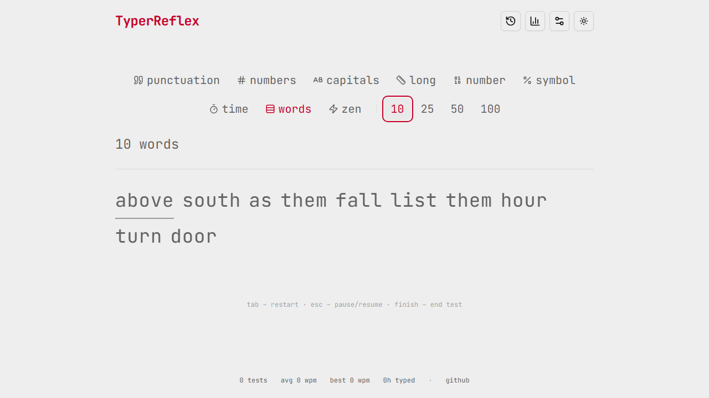
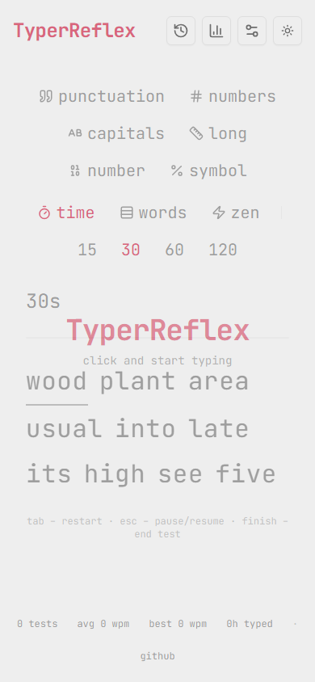

# TyperReflex

Test de mecanografía (typing speed test) minimalista inspirado en monkeytype, construido con **React 19**, **TypeScript**, **Vite** y **Tailwind CSS 4**. Mide WPM, precisión y consistencia, con historial, récords personales, estadísticas y PWA instalable.

## Características

### Test

- **Modos**: tiempo (15/30/60/120 s), palabras (10/25/50/100), **zen** (sin límite, termina con `Tab`/`Esc`/botón _finish_) y práctica dedicada (solo números, solo símbolos).
- **Opciones de texto**: puntuación, números, palabras con mayúscula inicial, modo **largo** (top-200 palabras más largas).
- **Tipeo**: caret block o bar con movimiento suave, sonido de tecla opcional, shake en errores, flecha flotante al final de la fila, blaming de caracteres omitidos, **modo estricto** (no avanza con palabra incorrecta), flash al corregir con backspace.
- **Flujo UX**: pausa/reanuda con `Esc` sin perder el test, confirmación de reinicio opcional, botón _finish_ en cualquier momento, onboarding tooltip la primera vez, auto-focus en el área de tipeo.
- **Atajos de teclado**: los atajos aplican solo en reposo (el tipeo siempre gana dentro del input).

### Resultados

- WPM y raw WPM, precisión, consistencia (100 − desviación estándar), percentil contra tu propio historial.
- Gráfico **WPM vs tiempo** y **heatmap de errores por tecla** (recharts).
- **Top 10 errores** más comunes (tecla presionada vs. esperada).
- **Historial** persistente con filtros por modo, **récords personales** (PB) y exportar/copiar/compartir resultados.
- Confeti al romper un PB (opcional).

### Personalización

- **Settings persistentes** (localStorage): fuente (JetBrains Mono / IBM Plex Mono), tamaño, gap entre palabras, sonido, shake, caret, confirmación de reinicio, modo estricto, tema, color de acento y **presets**.
- **Temas de fondo**: Classic gray, Lavender, Sage, Ocean y Sand (con light/dark).
- **Paletas de acento**: Crimson, Ocean, Forest, Violet, Amber, Matrix y Gruvbox.
- **Light/dark/system** con toggle en el header (tecla `d`), sin flash en la carga.

### Plataforma y calidad

- **PWA**: instalable, offline (service worker con precache), manifest + iconos.
- **Rendimiento**: lista de palabras virtualizada, componentes memoizados, timers por `performance.now()`, code-splitting (radix y recharts fuera del chunk principal).
- **Accesibilidad (WCAG AA)**: navegación por teclado, `aria-live` para resultados y timer, `prefers-reduced-motion`, zoom 200% sin romper layout.
- **Responsive**: toolbar en dos filas en mobile, sin scroll horizontal.

## Stack

| Área    | Tecnología                                                                       |
| ------- | -------------------------------------------------------------------------------- |
| UI      | React 19, Tailwind CSS 4, radix-ui, lucide-react, recharts                       |
| Build   | Vite 7, @vitejs/plugin-react, vite-plugin-pwa                                    |
| Tests   | Vitest + Testing Library (unit/component), Playwright (E2E, 3 browsers)          |
| Calidad | ESLint 9 + typescript-eslint, Prettier, Husky + lint-staged, TS strict sin `any` |

## Requisitos

- Node.js 20+
- npm

## Inicio rápido

```bash
npm install     # instalar dependencias
npm run dev     # servidor de desarrollo (http://localhost:5173)
```

## Scripts

| Script                  | Descripción                                           |
| ----------------------- | ----------------------------------------------------- |
| `npm run dev`           | Servidor de desarrollo                                |
| `npm run build`         | Build de producción (`tsc -b && vite build`)          |
| `npm run preview`       | Servir el build localmente                            |
| `npm run typecheck`     | Chequeo de tipos (TS strict)                          |
| `npm run lint`          | ESLint                                                |
| `npm run lint:fix`      | ESLint con auto-fix                                   |
| `npm run format`        | Prettier (reescribe)                                  |
| `npm run format:check`  | Prettier (solo verifica)                              |
| `npm test`              | Unit + component tests (Vitest)                       |
| `npm run test:watch`    | Vitest en modo watch                                  |
| `npm run test:e2e`      | E2E (Playwright, 3 browsers)                          |
| `npm run test:e2e:ui`   | E2E con UI de Playwright                              |
| `npm run build:analyze` | Build + reporte de bundle (`dist/bundle-report.html`) |
| `npm run commit`        | Asistente interactivo de Conventional Commits         |

## Atajos de teclado

| Tecla                 | Acción                                                    |
| --------------------- | --------------------------------------------------------- |
| `Tab`                 | Reiniciar test (confirma si hay progreso y está activado) |
| `Esc`                 | Pausar/reanudar (o cerrar el overlay de confirmación)     |
| `1` / `2` / `3` / `4` | Duración: 15 / 30 / 60 / 120 s                            |
| `p`                   | Puntuación on/off                                         |
| `n`                   | Números on/off                                            |
| `c`                   | Mayúsculas on/off                                         |
| `l`                   | Modo largo on/off                                         |
| `m`                   | Ciclar modo (words → time → zen → numbers → symbols)      |
| `d`                   | Alternar tema light/dark                                  |
| _finish_              | Terminar el test y ver resultados (botón en la toolbar)   |

Los atajos solo se activan con el test en reposo y con el foco fuera del input: mientras tipeás, la tecla siempre es texto.

## Testing

```bash
npm test                # unit + component (jsdom)
npm run test:e2e        # E2E: chromium, firefox, webkit
```

- **Unit/component**: `src/**/*.test.tsx` — helpers puros (`src/lib/typing.ts`, `words.ts`, `settings.ts`, etc.), componentes (`TypingTest`, `ResultsScreen`, `ThemeProvider`, `ToolBtn`).
- **E2E**: `e2e/*.spec.ts` — flujo completo de tipeo, persistencia, responsive, accesibilidad y UX (pausa, modo estricto, confirmación de reinicio, onboarding).
- CI en GitHub Actions (`.github/workflows/ci.yml`): lint + typecheck + unit, y E2E en los 3 browsers.

## Convenciones de código

- **Conventional Commits**: `feat(ux): add strict mode`, `fix: ...`, `docs: ...`, `test(e2e): ...`. El hook `commit-msg` valida el formato (asistente: `npm run commit`).
- **TypeScript strict**: sin `any` (ESLint `no-explicit-any`).
- Pre-commit: ESLint `--fix` + Prettier vía lint-staged.
- La estructura `src/components/ui/*` es shadcn/ui adaptada: no reescribir, extender si hace falta.

## Deploy (Vercel)

La app está configurada para Vercel (`vercel.json`):

```bash
vercel                 # preview
vercel --prod          # producción
```

Configuración: framework Vite, build `npm run build`, output `dist`. URLs limpias y fallback a `index.html` para el PWA. Variables de entorno opcionales (ej. `VITE_BASE_PATH`) en `.env.example`.

## Estructura

```
src/
  components/        # TypingTest, ResultsScreen, dialogs, toolbar, ui/*
  lib/               # words, typing helpers, settings, history, stats, utils
  test/              # setup de Vitest
e2e/                 # specs de Playwright
public/fonts/        # JetBrains Mono variable (self-hosted)
```

## Roadmap / plan

El plan de mejoras completo y su estado vive en [`PLAN_MEJORAS.md`](PLAN_MEJORAS.md).

## Screenshots





